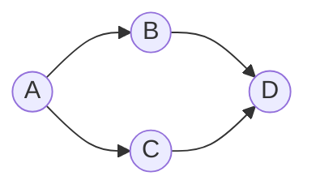

# The Event Graph

Most of Okayeg's behavior comes from how it stores changes, so it's worth
understanding that shape before anything else.

## Changes Form a Graph

As Okayeg works on top of Loro, when you edit a document, Loro doesn't store
the resulting text. It stores the change you made (an insert or delete at a
position) as an **op**. Each op records which ops came immediately before it
(its *parents*). The result is a directed acyclic graph of ops, much like git's
commit graph, but at the granularity of individual edits rather than whole
snapshots.

Here two people edited from a common point `A`: one made `B`, the other made
`C`, concurrently. `D` is built on both: a merge. Nothing is lost; the graph
records exactly what happened and what each op was aware of.

Okayeg is the layer that syncs between the filesystem and the underlying Loro
document storing the ops.

## Content Addressing

Every op has an identity derived from its content and its parents similar to
how git names its commits. An op can't be silently altered, because changing it
would change its identity, and any op can be referred to unambiguously by that
identity.

## Conflict-Free

Because every op knows its parents, the engine can compute a single,
deterministic result from any set of ops regardless of the order they arrive
in. Two people typing in the same paragraph at the same time produce concurrent
ops that merge into one consistent text, with no conflict markers.
