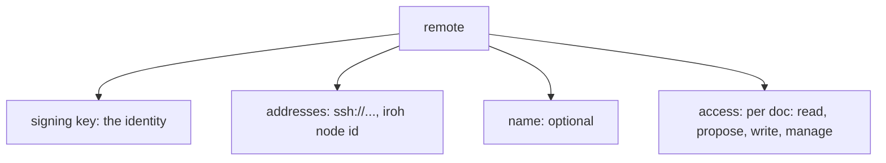

# Remotes

A remote is the local record Okayeg keeps about a peer, keyed by that peer's
signing key. The key is the identity (see [Identity and
signing](identity.md)), and everything else in the record hangs off it.

A record holds:

- The peer's **signing key**, which identifies the remote and stays fixed
- The **addresses** where the peer can be reached over a transport, which are
  the current routes to it
- An optional **name**
- The **access** granted to that key (see [Access control](access-control.md)),
  per doc

You keep a record for every peer you sync with, in either direction, including
downstream peers, since access control is keyed to the signing key and a peer's
access is part of its record. A live connection is a current session with one
of these keys, and the record persists whether the peer is connected at the
moment or not.

Because the record is keyed by the signing key, a peer that reconnects from a
new address is the same remote on a new route. The addresses are how to reach
it, and the key is who it is.

## Names

A remote can carry a name, and by default you refer to it by the address you
connected through. The first upstream remote, when none are configured,
conventionally takes the name `origin`, the way git does.
