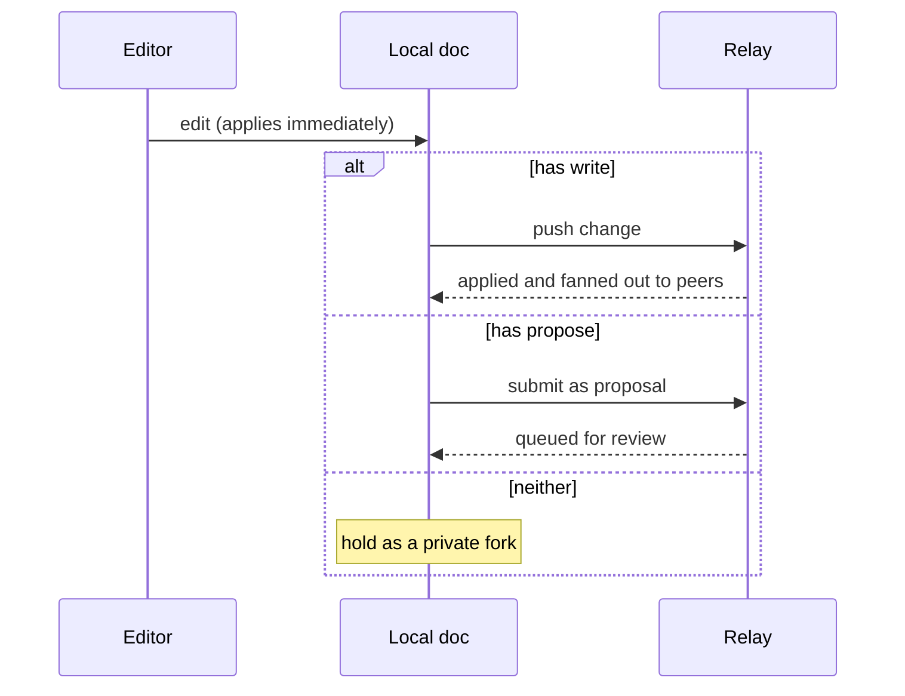
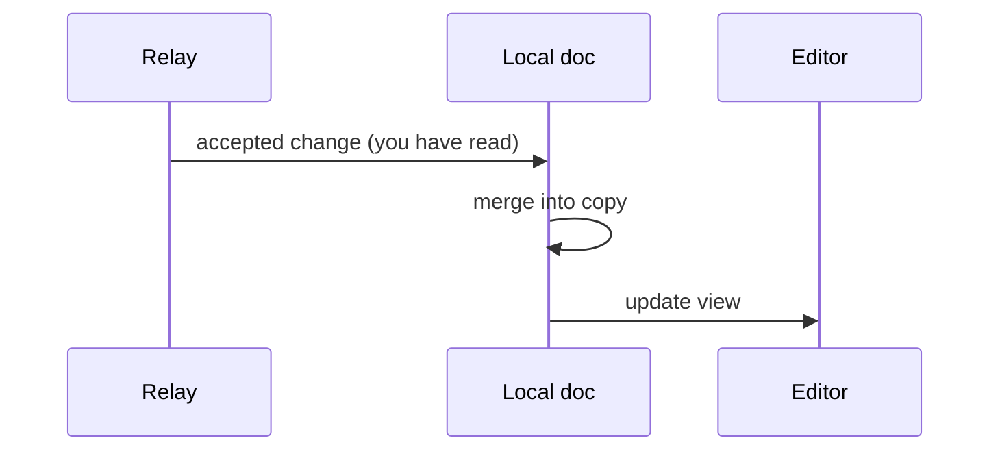
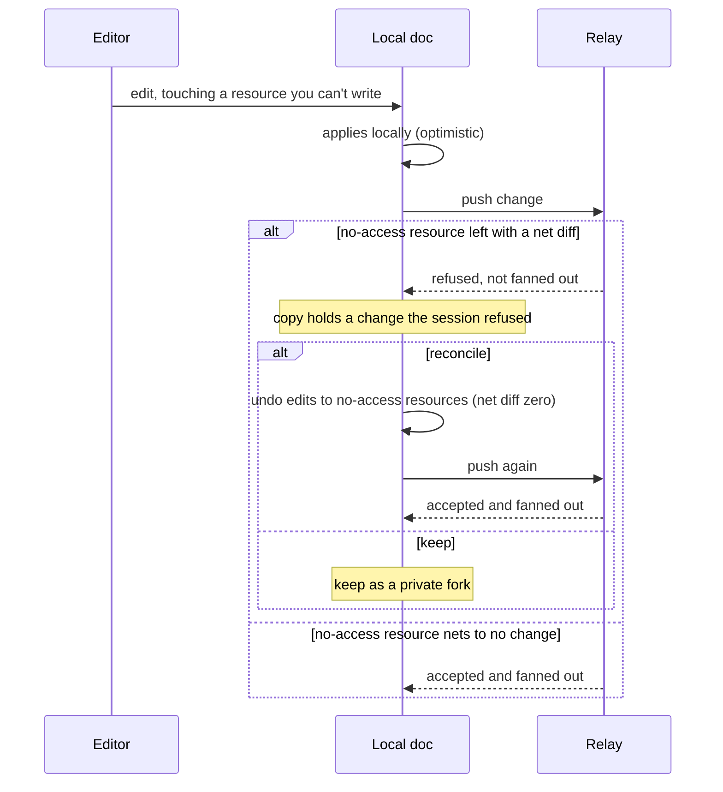

# Sync

Follow a single edit to see how syncing works.

## A Change Applies Locally First

When you make an edit, it lands in your own copy of the doc immediately. Your
copy is always writable, whatever your access to a remote, because the copy on
your machine is yours. Whether that change travels anywhere is a separate
question, settled after it has already applied locally.

## Push, Submit, Hold

Once a change has applied locally, okayeg propagates it in the strongest way
your access to the doc allows. There are three outcomes:

- **Push**: you have write access, so the change streams upstream and merges
  into the shared doc live.
- **Submit**: you have propose access, so the change goes upstream as a
  proposal for someone with write access to accept or deny.
- **Hold**: you have neither, so the change stays in your copy as a private
  fork.

Your client learns your access for a doc when it connects, so it picks the right
outcome directly. The three describe what happens to a change, and any client
can fall back down the list when access is lower than it hoped.

Push and submit run at different tempos. A push is continuous: each change
streams as you make it, so collaborators see your edits live. A submit is
batched, because a proposal is a bundle that someone reviews as a unit, so edits
accumulate in your fork and are offered together.

## Downstream and Upstream

Receiving and sending are independent directions, each with its own access.

- **Downstream** is gated by read access. Every change the doc accepts is
  streamed to you and merged into your copy.
- **Upstream** is gated by write or propose access, through push or submit.

Because they are independent, you can keep receiving downstream while holding
local changes that never go upstream. Incoming changes merge cleanly with your
local fork, so your copy stays current for reading even while your own edits
remain yours alone.

## Real Time and Reconciling

In real-time mode, changes stream upstream as you type and arrive at peers as
they happen. Since a change applies to your copy before the relay sees it, your
screen can show an edit the relay later refuses. The relay checks which
resources a change touches against your access and fans out the changes you are
allowed to make. It refuses a change that leaves a resource you can't write
altered. A change that touches such a resource and leaves it with a net empty
diff (edits that cancel out) is still accepted, since nothing you lack access
to actually changed.

A refused change reaches no one else, so the shared session stays consistent.
Your copy is then ahead of the session by that change, and because your copy is
sovereign, it stays until you decide what to do with it. Reconciling can mean
undoing just your edits to the resources you can't write, which results in a
net empty diff and lets the rest of your change through. You can also keep the
change as a private fork and let it stay yours.

Enforcement lives entirely on propagation. A relay forwards downstream only
what you can read and accepts upstream only what you can write. Editing your
own copy always succeeds; access decides what leaves it and what reaches you.
