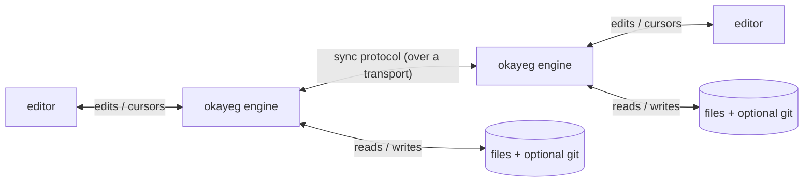

# System overview

Okayeg is a system for **local-first, real-time, conflict-free** collaboration
on files built on [Loro](https://loro.dev) (an implementation of eg-walker),
where:

- **local-first** means your copy lives on your computer and keeps working
  while you're (temporarily) offline and stays fully yours even if you stop
  collaborating
- **real-time** means edits and cursor movements appear immediately while
  you're connected to a peer
- **conflict-free** means concurrent edits to the same file always merge
  cleanly, with no conflict markers, no matter what order they arrive in
- **access control** means you decide who can see which changes, and whose
  changes get into your copy

Here's how the pieces fit together:

## The Engine

On each participant's computer there's an okayeg engine. It **owns the
document** — the conflict-free data structure (a [Loro](https://loro.dev) event
graph) holding the real history of every change.

## The Editor

Your text editor, through a thin Okayeg binding, sends each character edit and
cursor movement to the engine as you type, and renders the document (and peers'
cursors) back. The binding is deliberately small so okayeg stays
editor-agnostic.

## The Sync Protocol & Transports

Engines exchange changes over a transport-agnostic **sync protocol** ("here's
my frontier, send me what I'm missing," plus signed proposals). *How* those
bytes travel (peer-to-peer, HTTPS, SSH, or even a USB stick) is a pluggable
**transport**, the same way git works over many protocols.
