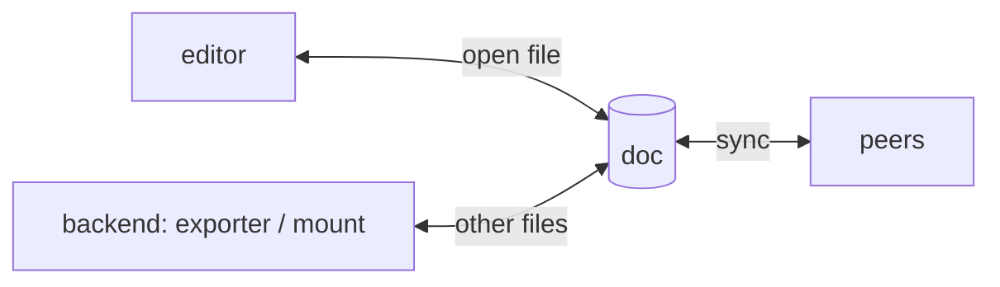

# Editor integration

An editor that speaks Okayeg edits the doc directly. A keystroke becomes an edit
to the doc without being written to a file first, which is what lets edits and
cursors from other people show up right away. This is a third way to
[materialize](materialization.md) a doc, and it works alongside one of the
other two rather than replacing them.

## Editing is a layer over a projection

The editor does not take over materialization. It takes over one file at a
time. While a file is open in the editor, the editor is the one folding edits
into the doc for that file, and the underlying backend keeps materializing
every other file as usual. A project mounted with FUSE or exported to disk
still needs its other files present, so a compiler can read the whole thing.

The rule that keeps this working is that one thing writes a given file into the
doc at a time, the editor or the backend, never both. When an editor opens a
file it claims that file, and the backend stops writing it. When the editor
closes the file the backend takes it back. Without this, the backend's writes
and the editor's edits would each be read as changes by the other, and the file
would fill up with echoes.

A claim lasts as long as the editor's connection. If the editor exits or its
connection drops, every file it held is released at once. This is the same
shape as a capability in [access control](../concepts/access-control.md): a
claim is held for the life of the connection, and it ends when the connection
does, rather than expiring on a timer that could release a file someone is
still editing.

## Reconciling the editor and the doc

An editor's buffer is plain text, and the user keeps typing into it while
edits arrive from other people. Two streams of edits are changing the same
buffer at once, and they have to be reconciled against each other. The doc's
CRDT reconciles edits between peers, but the buffer is not a peer, so it does
not cover this. There are two ways to close the gap. The editor and the doc can
reconcile through operational transform, tracking a revision number on each
side so an edit can be adjusted for edits it did not yet know about. Or the
buffer can be modeled as its own small doc and synced to the main one, which
reuses the CRDT and drops the operational transform. teamtype uses operational
transform here, and its editor plugins are a working reference for the protocol.

## Saving

Saving means committing the change to the doc, which then syncs to other
people. Whether saving also writes a file depends on the backend. With the
exporter, saving writes the file, which matters because a compiler reading the
file needs the current bytes. With a mount there is no separate file to write.
Either way the editor does not need to know which backend is underneath; it
commits, and the backend does whatever its host requires.

## Why open files are safe from lost edits

Folding a changed file into the doc has a hazard: if the comparison is made
against the doc's current content after a peer's edit has arrived, the peer's
edit can be dropped (see [materialization](materialization.md)). Open files
avoid this hazard, since an editor sends its edits to the doc directly, with no
file for `eg` to compare against. There is no file round trip for an open file,
so there is no stale version to read from and nothing to drop. This is the reason
the claim mechanism pauses the backend rather than letting both write.
