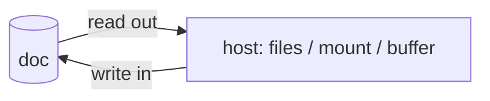

# Materialization

[Materialization](../concepts/materialization.md) is how a doc becomes
something a host can work with. The doc is the source of truth, and a
materialization backend projects it into one host, such as a directory on
disk, a mounted filesystem, or an editor's buffer. Each backend only deals
with the quirks of its own host, which keeps the projection logic out of the
doc model.

A backend does two jobs: it reads the doc out so the host can see it, and it
writes the host's edits back into the doc. Splitting these two jobs apart is
what lets the backends differ: a backend can own just one of them, or hand one
of them to some external system (see [editor
integration](editor-integration.md)).

## Exporting

The filesystem exporter does both jobs by hand. It writes files to disk,
watches the directory for changes, and applies those changes back to the doc.
The files and the doc end up as two copies of the same content, so the
exporter has to reconcile them, with debouncing and echo suppression to keep
its own writes from being read back in as edits. The standing risk is that the
two copies drift apart.

## FUSE mounts

A FUSE mount removes the second copy. Rather than writing files for the host to
read, the kernel asks the backend for bytes on each `read`, and the backend
serves them from the doc. A `write` goes into the doc directly. There is only
one store, so there is nothing to drift.

A mount does not sit behind the `Workspace` trait that the exporter uses. The
exporter calls the filesystem, so a trait that abstracts the filesystem suits
it. With a mount the kernel calls the backend instead, so the mount is a
sibling backend rather than another `Workspace` implementation.

The mount stays an option rather than the default, since it costs more than the
exporter in a few places. It needs FUSE, which works well on Linux and less so
elsewhere. macFUSE has no passthrough, so on macOS every read pays a full trip
into userspace. A mount also lives and dies with its process, while exported
files survive a crash. Before trusting the mount to be fast enough, a full
Typst compile should be measured through it, once per platform.

## Reading from the doc

A mount serves a `read` by slicing bytes out of the doc's text. Loro stores
that text as a rope whose nodes cache their length in bytes, so a slice at a
byte offset is a walk down the tree rather than a scan of the whole file. The
mount can hand the kernel's byte offset straight to Loro and get back the right
range in time proportional to the depth of the tree which is \\( O(\log n) \\).

This means the mount holds no snapshot of an open file. The tradeoff is that a
remote edit can move bytes underneath a reader partway through reading, which
is the same thing that happens when a file changes on disk while a program
reads it. When a remote edit lands, the mount tells the kernel to drop its
cached pages for that file, so the next read returns current content.

## Where the mount lives

By default a mount covers the project root, so the doc appears as the project
directory itself. This matches what people expect from `.eg`: a directory with
`.eg` in it is the project, the same way a directory with `.git` in it is a git
repository, and moving the project is just moving the directory.

Mounting over the project root hides the real `.eg` underneath the mount, and
`eg` still needs to read it. Before mounting, the backend opens a handle to
`.eg` and keeps it. Every access to `.eg` afterward goes through that handle
instead of its path, because resolving the path would go back through
the mount and deadlock. The mount also has to add `.eg` back into the root
listing, since the doc itself does not contain it. This handle is the same kind
of confined directory handle that `CapWorkspace` already uses, so the mount
reuses the existing boundary rather than inventing a new one.

A mount can also cover a directory that is not the project root. Then it hides
nothing and needs none of the handling above. This is the simpler case, and it
stays available for a read-only view or for hosts where mounting over the
project directory is not possible.

The mount point and the confinement boundary are independent. `CapWorkspace`
confines what `eg` reads and writes on the real filesystem, rooted at the
project directory wherever the mount happens to be. So mounting outside the
project does not widen what `eg` can touch.

## Watching for changes

The kernel raises an inotify event when a program changes a file through the
mount, so a local edit is seen. It does not raise one when a remote edit lands,
because that change reaches the doc without any filesystem operation. A tool
that recompiles on inotify events (e.g. `typst watch`) therefore sees local
edits on a mount but misses a collaborator's edits.

Tools built for Okayeg avoid this by subscribing to the doc's change
notifications rather than watching files. A foreign tool that has to see a
collaborator's edits as file changes is a reason to use the exporter, where a
remote edit becomes a real write and does raise an inotify event. A future
option could have the mount rewrite a changed file through its own mount point
on a debounce so that foreign watchers wake up, and the mount should keep its
change handling general enough to add that later.

## Folding edits back in

A file records only its final content, not the edits that produced it, so
folding a changed file into the doc means diffing it against a previous version
and turning the diff into edits. The version to compare against is the last
content `eg` and the file agreed on, which is not the same as the doc's current
content once a peer's edit has arrived. Comparing against the current doc would
read a peer's inserted text as text to delete, since the file never had it, and
the peer's edit would be lost.

So `eg` keeps, per file, a marker for the version it last agreed on, separate
from the live doc. The content of that version comes from the doc's own history
rather than a second stored copy. It compares an incoming file change against
that version and merges the difference into the doc through Loro so that a
concurrent peer edit and the local edit both survive. The marker updates in
both directions: when `eg` writes the doc out to a file, and when it reads a
file change in.
[Editor integration](editor-integration.md) avoids this comparison entirely
for open files, since an editor sends its edits to the doc without going
through a file.

## Choosing a backend

A repository records which backend it uses in a `[materialize]` table in
`.eg/config.toml`.
