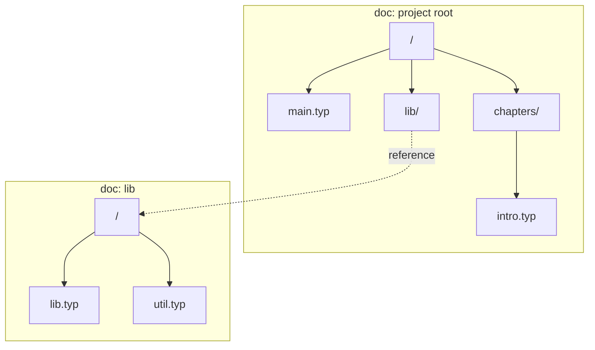

# Repository Layout

Okayeg's only primitive is the doc. A doc is a single Loro document with its own
event graph and history, and it is the unit that Okayeg syncs and gates. A doc
holds one or more files. A set of files that always belong together can live in
the same doc so that they share a history and move as a unit. Each doc is
independent of every other: it has its own version, its own history, and is
analogous to a git repository.

## The doc is the boundary

A doc is the boundary for atomicity, consistency, gating, and sync. Everything
inside one doc shares a single history and event graph, so a change that touches
several files in the same doc lands atomically and the doc stays internally
consistent. These are the guarantees git gives a repository. A doc can carry its
own directory structure, so a set of files that must change and move together
can live in one doc and behave as a unit.

Across docs, those guarantees stop at the boundary. Each doc has its own
history, so a change spanning two docs is two separate operations, and one can
land while the other is still in flight. Syncing several docs at once is a way to
manage them together.

Permissions follow the same boundary, which makes finer-grained access both
possible and easy to enforce. Write access is decided per doc, so a peer can
hold write access to one doc and read-only access to another, the same control
git gives through submodules and separate repositories where permissions apply
to a whole repo. Because each doc is its own history, refusing an unauthorized
write stays contained: rejecting a write to a doc a peer cannot write leaves
their writes to docs they can write untouched, since the two are separate
streams. Inside a single doc everything shares one history, so an unauthorized
write is interleaved with the authorized writes around it, and refusing it
without disturbing the rest is much harder.

This makes laying out a project a deliberate choice. Files that must stay atomic
and consistent with each other, and that share the same access, belong in one
doc. Units you want to version, sync, or gate on their own belong in separate
docs, where the cost is that they lose atomicity with each other. "Should these
change together?" and "should these be gated together?" become the same
question, settled by whether they share a doc. Okayeg gives strong guarantees
inside each boundary; where the boundaries fall is decided by whoever lays out
the project.

## Directories and boundaries

Within a doc, directories are part of that doc's own structure. The whole tree
of folders and files in one doc lives in its single history.

A boundary between docs is marked by a reference. The parent doc records, at the
path of a child, an entry pointing to a separate child doc by id, much like a
gitlink points to a submodule. A child doc can itself reference further docs, so
a project is a root doc together with all the docs it transitively references,
each keeping its own history. A manifest accompanies these references with the
configuration needed to locate and fetch each child doc from a remote, the way
`.gitmodules` records where each submodule comes from.

A path is resolved by walking this structure: follow each segment through a
doc's directories, and where a segment lands on a reference, cross into the child
doc and continue there. Because a child is named only inside the doc that
references it, a child is reachable only if you can read that parent; a doc you
cannot reach through any reference you hold is not part of your view.

In the tree below, the project root and the `lib` child are two separate docs.
Solid edges are structure inside a doc; the dashed edge is a reference crossing
the boundary into the child doc.

## Splitting and absorbing

A project starts as one doc and stays that way until you draw a boundary. `eg
split` carves a directory into its own doc: it creates a new doc from the
subtree's current state, replaces the inline subtree in the parent with a
reference, and records the child in the manifest. Because a subtree's ops cannot
be carved out of the parent's history, the new doc begins from the current state
as fresh history while the subtree's past stays in the parent — the same trade
as extracting a subdirectory into its own git repository.

`eg absorb` is the reverse: it folds a referenced doc's current state back into
the parent inline and drops the boundary. Together they make laying out a project
feel like managing monorepos and submodules in git, converting between the two
as the project's needs change.
